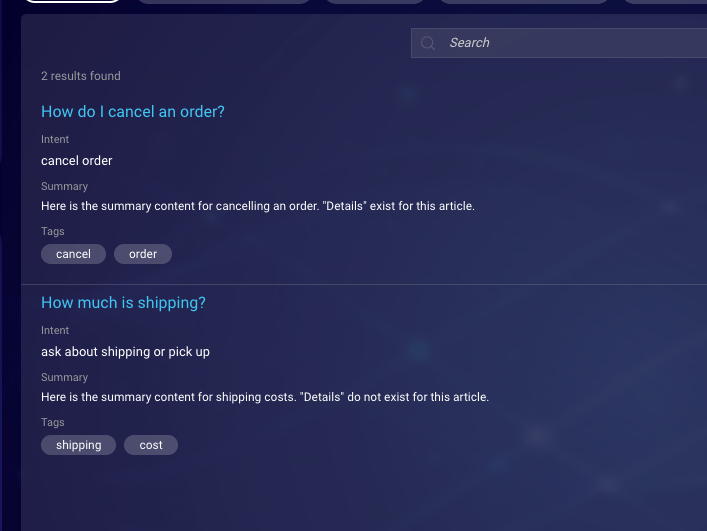
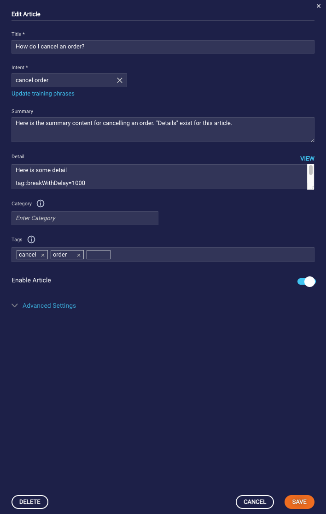
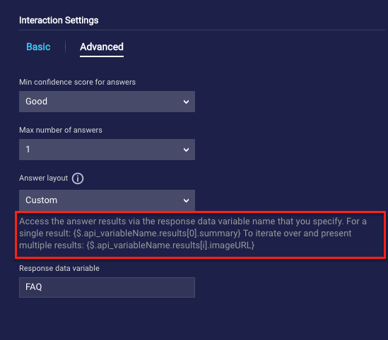
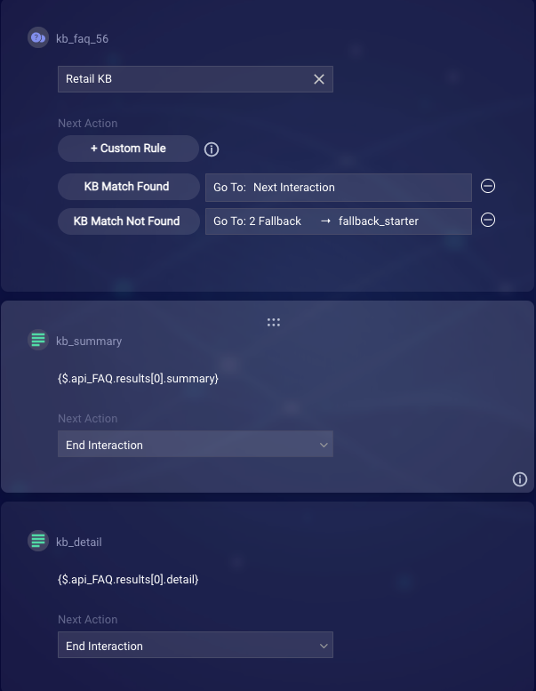

# Using the Detail Field in Knowledge Base Articles

The **summary** section in Knowledge Base articles is limited to 300 characters. This is not always going to be adequate to cover everything that needs to be relayed to the user. With this limitation, longer text content will need to be distributed between the **summary** and **detail** fields. I've created a simplistic example to show how this can be done in the **Add Article** form.



I've set up a simple example with a KB that contains two articles, one with just a summary and the other contains a summary and a detail section.

In this example, the article with a detail field populated will show 3 messaging bubbles: The Summary, the first half of the Detail, and the second half after using `tag::breakWithDelay=1000`. This is done so that even if you are using a large amount of text, you avoid shoving everything into one long message.



## Integrating into Conversation Builder using Knowledge AI interaction

The new [Knowledge AI interaction](https://developers.liveperson.com/conversation-builder-interactions-integrations.html#knowledge-ai-interactions) simplifies the process of calling a Knowledge Base integration and displaying the results to the user. This interaction provides *Structured* and *Simple* answer layout options, which automatically display the summary and other supported fields. However neither of these provide the ability to add in a detail field. There is a third answer layout option, *Custom*, which treats the response similarly to the original Knowledge Base integration. When using this option, you will need to create your own interactions to display the returned article content, but this will allow us to work with the results and display the detail when appropriate.

In the Knowledge AI interaction settings, go to the *Advanced* menu, change the **Answer layout** to *Custom*, and give your Response data variable a name (For this example, I'm using the variable name "FAQ"). Note the instructions on how to reference the variable below the Answer layout field.



After your Knowledge AI interaction, create two text interactions, one for the summary and another for the detail. Enter the appropriate resposne data variable names for each, and set the *Next Action* for each to **End Interaction**. This is done so that if the detail does not exist for the returned article, it will not move on to the `kb_detail` interaction and display the variable name to the user.



In the post-process code of the `kb_summary` interaction, insert the following code to check for the presence of the 'detail' field. If it exists, we will direct to the `kb_detail` interaction in order to display that information.

```js
var kbResponse = JSON.parse(botContext.getBotVariable('api_FAQ'));

if (kbResponse.api_FAQ.results[0].detail) {
  botContext.setTriggerNextMessage('kb_detail');
}
```

We can now test out our functionality to see if it performs as expected. Again, I have two articles in my knowledge base, one contains a "detail" section and the other does not. As you can see in this screenshot, the "How do I cancel an order" article properly shows the summary, detail, and an after delay message written in the detail. The "How much is shipping article" only shows the summary and because of our post-process code above, does not move onto the interaction which would display the detail if it existed.
