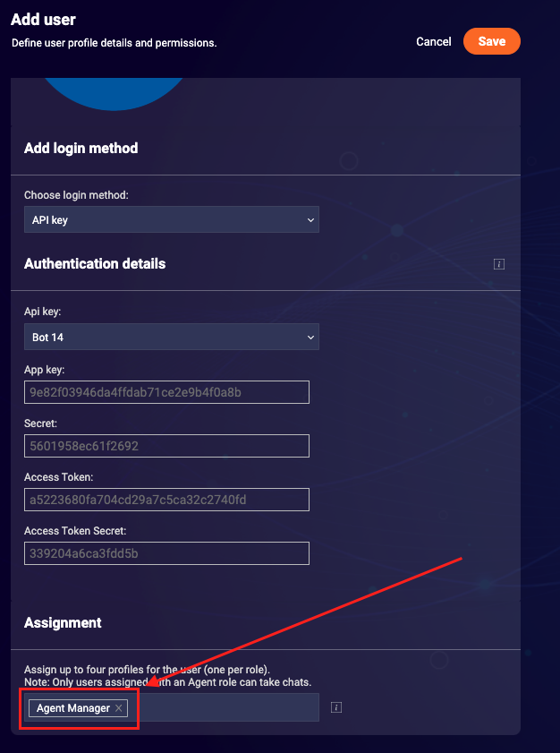
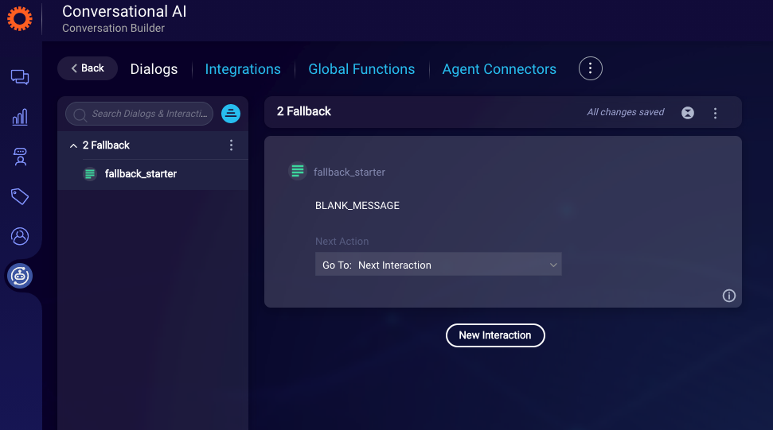
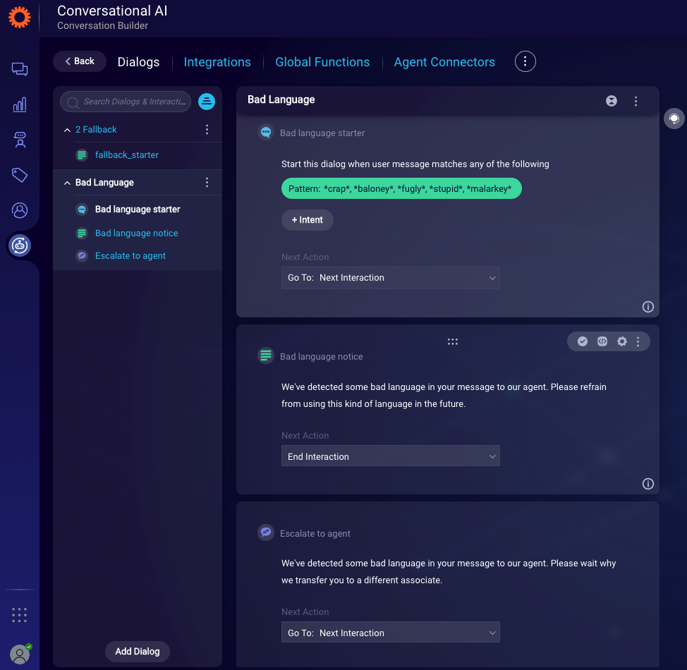
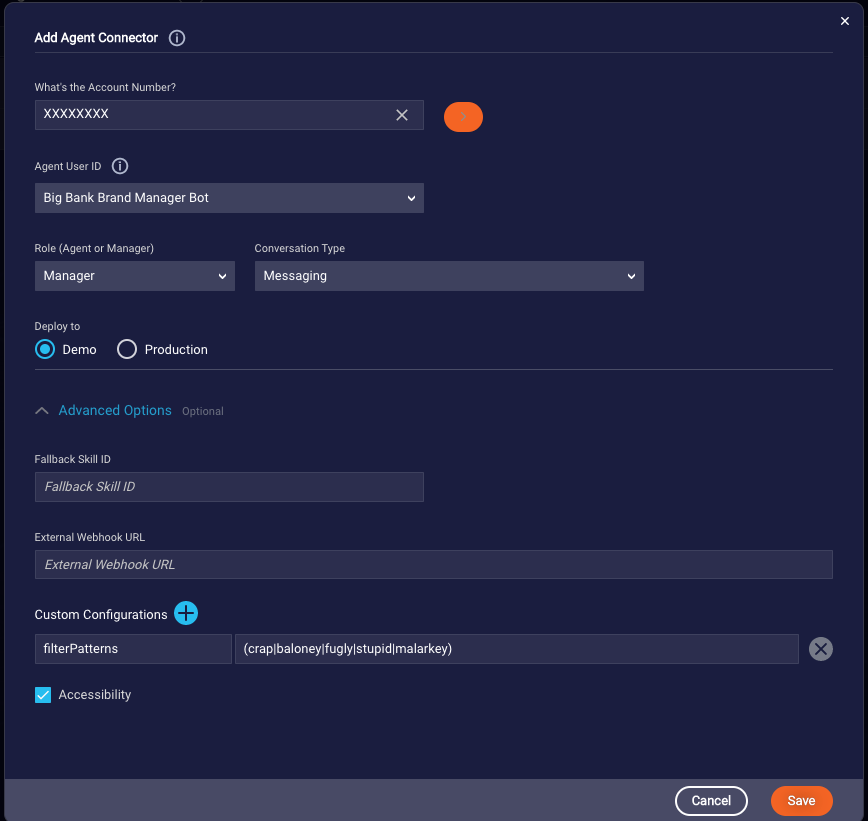
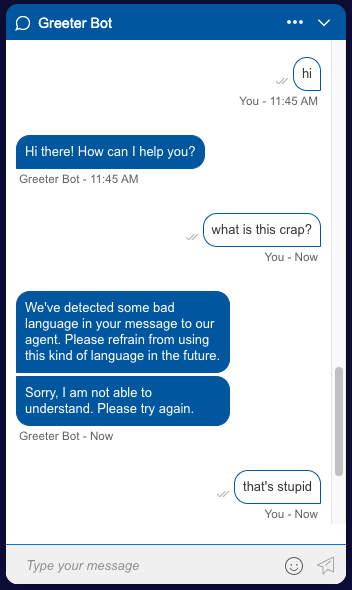
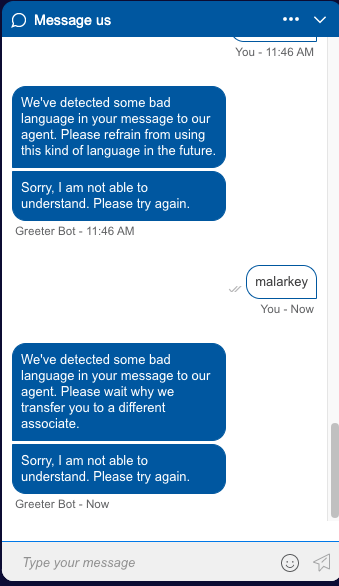
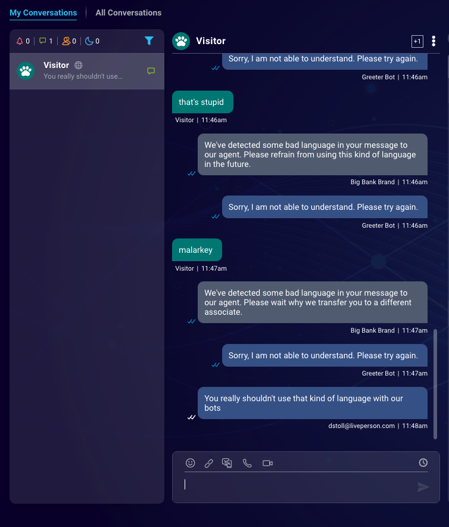

# Manager Bots
Previously, if you wanted shared logic between all the different bots on an account, you would need to incorporate that logic into each and every bot. As this can be a time-consuming and error prone endeavor, one solution to this problem is to incorporate a Manager Bot for the account. Manager Bots can ensure that sensitive processes are handled by one central bot that can act on every conversation, regardless of the bot or human agent that is handling the issue of the user.

## What are manager bots?
Manager bots are a feature of Conversation Builder which allow for a brand to have a single bot that joins and listens in to all active conversations for an account. These bots are built within Conversation Builder, just like any other automation, but are used in powerful ways to provide shared processes across all bots in an account. While the bots are created in the same ways that you would create any bot in Conversation Builder, the amount of power which they have by being added to every conversation requires thoughtful implementation and a strong understanding of how they operate. We highly recommend that you engage with the AI Engineering / ETS team before deploying these Bots to assist with reviewing suitability, planning & design.

## Building a "Bad Language" Bot
For this guide, we will demonstrate the manager bot's capabilities by creating a "Bad Language" bot, which will listen for specific phrases that involve swears or curse words. When these events occur, our bot will speak up to remind the user to refrain from using that kind of language with our agents. After 3 occurrences of bad language, we will then escalate to a human agent who has been trained to appropriately handle such customers. While this is a relatively simple use case, it will serve to show the capabilities of our manager bot which can be customized to fit your brand's unique needs.  

### Prerequisites
This guide assumes you have at least one bot that is deployed through the Conversational Cloud. For this use case, the function of that bot is unimportant; we just need to have something live that our Manager Bot can monitor over. For instructions on how to do so, please see our [Getting Started Guide](https://developers.liveperson.com/tutorials-guides-getting-started-with-bot-building-overview.html).

### Setting up the bot user agent
As with many bot solutions, the first step to building a manager bot will be to create a Bot User Agent that can be deployed across the account. Follow the same steps that you would when creating a standard bot agent (details on this process can be found in our [developers documentation](https://developers.liveperson.com/tutorials-guides-getting-started-with-bot-building-deploy-the-bot.html#step-13-create-a-bot-user)). The only deviation from what is explained in the documentation is we want to ensure you have given the appropriate role of *Agent Manager* to your Bot User profile, as this will allow the bot to join into and participate in agent conversations. 



As these bots will potentially be joining into and engaging with users on behalf of the brand, special care should be shown to the naming of the bot. As you wouldn't want a bot named "Abusive Customer bot" speaking to the users, it is recommended that a generic, brand specific name be given to your bot, ex: Big Bank Brand Bot. 

### Create the Bot
In Conversation Builder, create a new bot using the *Custom Bot* template. Give it a name and description and click **Create Bot** to start with our standard template.

In this use case, our manager bot will serve a single purpose of handling bad language from a user and eventually escalating if a threshold is reached. As such, we have no need for the provided *1 Welcome* dialog, so we can safely delete it. 

When we deploy this bot, we will add a custom configuration called `filterPatterns` to ensure that our manager bot is not processing every single message from a user. However, it is still recommended that we modify the *2 Fallback* dialog to display a blank message in the unlikely event that a message passes the `filterPatterns` configuration and isn't recognized by a dialog starter. To do so, replace the *fallback_starter* text to read `BLANK_MESSAGE`.



#### Global Functions
To assist us with logging the number of bad language occurrences from our users, add the following custom code into the Global Functions code editor:

```js
function __initConversation() { 
	var badLanguageOccurrences = 0;
	var badLanguageThreshold = 3;
	botContext.setBotVariable('badLanguageOccurrences', badLanguageOccurrences, true, false);
	botContext.setBotVariable('badLanguageThreshold', badLanguageThreshold, true, false);
}

function processBadLanguage() {
	var badLanguageOccurrences = parseInt(botContext.getBotVariable('badLanguageOccurrences'));
	var badLanguageThreshold = parseInt(botContext.getBotVariable('badLanguageThreshold'));
	// Increment bad language occurrence count
	badLanguageOccurrences++;
	// Re-set bot occurrence bot variable
	botContext.setBotVariable('badLanguageOccurrences', badLanguageOccurrences, true, false);
	// Direct to escalation interaction if threshold is reached
	if (badLanguageOccurrences >= badLanguageThreshold) {
		botContext.setTriggerNextMessage('Escalate to agent');
	}
}
```

This code initializes two bot variables which we will use to determine when to escalate to an agent. We are also defining a function which will run the comparison of the two variables and direct to the escalation interaction when our threshold has been reached. Defining the function here in Global Functions allows us to easily call it in the pre-process code of our *Bad Language* dialog interaction.

#### Create the *Bad Language* Dialog
After saving our Global Functions, return to the *Dialogs* section of Conversation Builder and add a new dialog called *Bad Language*. For this example, we are going to hard code some words as patterns to trigger this dialog. As manager bots are constructed the same way as standard bots, you can also use Domains and Intents to trigger this dialog, but for the sake of simplicity we will stick with patterns.

Add the following patterns in the `dialog_starter`:
* `*crap*`
* `*baloney*`
* `*fugly*`
* `*stupid*`
* `*malarkey*`

> Note: By using the wildcard character (`*`), we can be confident that this dialog will be matched if any of these words are said by the user.

Add a new *Text* interaction which asks our user to discontinue using that type of language with our agent and set the **Next Action** to `End Interaction`. In the *Pre-Process Code* section for this interaction, call the `processBadLanguage` function that we previously defined in Global Functions.

```js
// Call the processBadLanguage function
processBadLanguage();
```

Next, add an *Agent Transfer* interaction with a transfer message and skill ID to correspond to a human agent that can handle these types of situations. Make sure to name the interaction `Escalate to agent` to match with the `setTriggerNextMessage` value in our `processBadLanguage` function.



### Deploy the Manager Bot
Navigate to the *Agent Connectors* section and click **Add Agent Connector**. Select the Bot Agent we created above from the *Agent User ID* dropdown and `Manager` from the *Role* dropdown. Before saving, expand the *Advanced Options* menu and select the **Plus** button next to *Custom Configurations*. Here, enter `filterPatterns` as the key and the following regex as the value: `(crap|baloney|fugly|stupid|malarkey)`. By entering this custom configuration, we ensure that our manager bot will only process utterances which pass the regex. This is an important step, as we want to limit the number of messages that our manager bot has to process from every conversation.



> Note: If you plan on using debug phrases with your manager bot, such as *reset* and *display userid*, you will need to add these as regex to your `filterPatterns` list. Failing to do so will result in your manager bot not recognizing these commands.

Once you've added the Agent Manager Connector, pushing the **> Start** button will deploy the manager bot. This bot will now join all the current active and new conversations for this account, so again take care to ensure that you have taken all steps to ensure suitability and that you've planned appropriately.

### Test the Manager Bot
After you've started up your manager bot, navigate to a page that you have deployed a bot from your account to. Communicating with your bot, you should not see any change unless you type in a phrase that matches one of the `filterPatterns` defined above. To test the Manager Bot functionality, type in a phrase with one of the *bad language* words we defined. Doing so should result in the bad language dialog being triggered, in addition to the standard bot's message. Continue to do so two more times to confirm that the logic in our escalation function is working properly.

 
