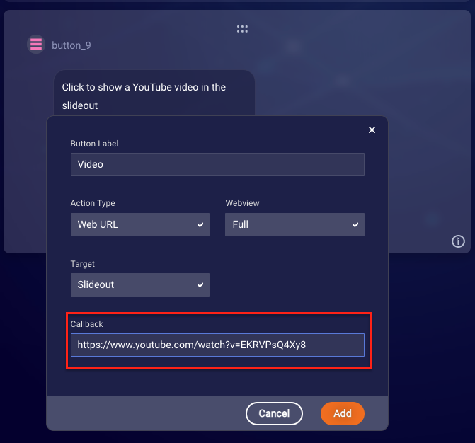
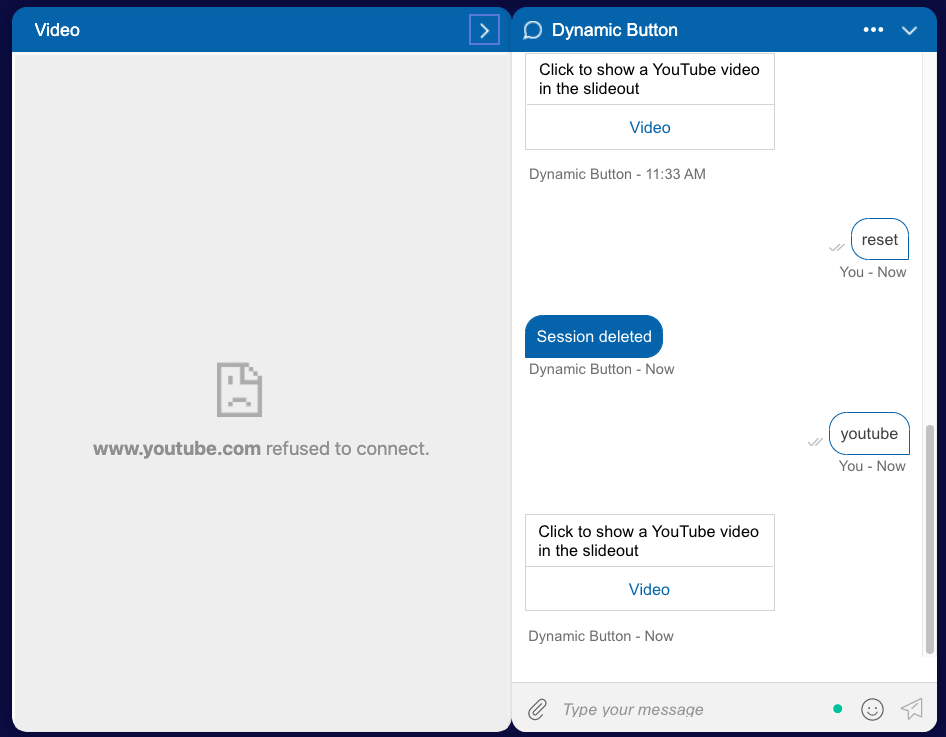
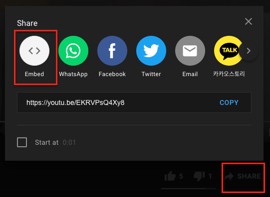
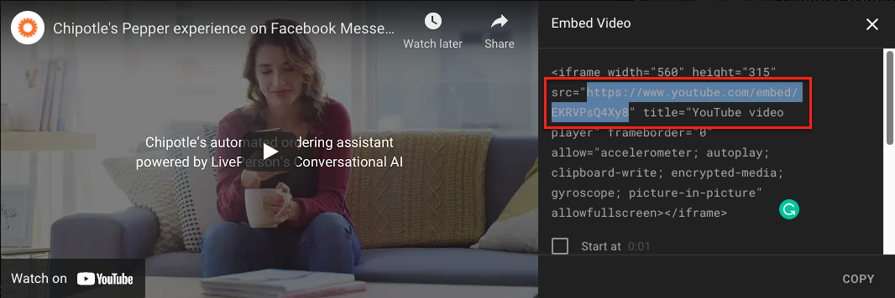
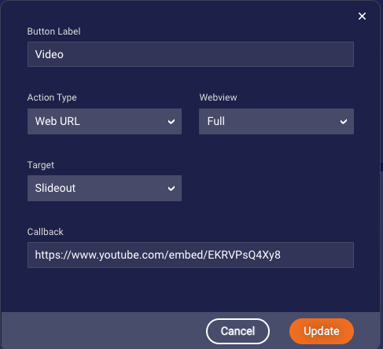
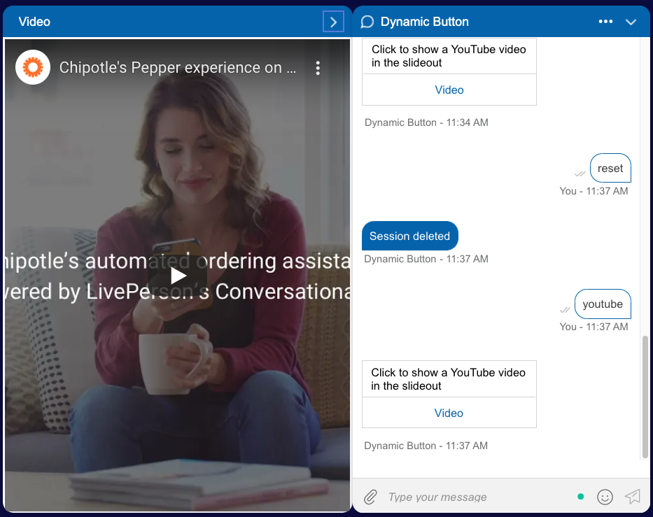

# Display a YouTube Video in Slideout

Conversation Builder button and structured content interactions support a slideout target for web URLs to display content to the side of a web messaging engagement. The slideout is an ideal location to place video content to show alongside a conversation. However, Google sites do not support being displayed in an iframe by default. Attempts to use the "Share" link for a YouTube video result in a "refused to connect" error within the slideout.

YouTube’s "Embed" share option generates HTML that one would insert into a web page to bypass this limitation. This HTML contains a link that correctly displays within an iframe

1. From the video page, select the "Share" link at the bottom of the video.
2. In the share menu, select the "Embed" option. 
3. Grab the URL from the `src` property of the generated HTML. 
4. Paste this link into the **Callback** field of the button interaction. 
5. Test using a web messaging deployment to see the video in the slideout.

